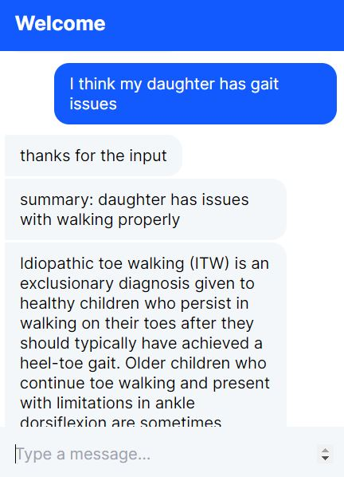

# Diagnostic Chatbot for Neurodevelopmental Disorders (NDDs)

This project is a Diagnostic Chatbot designed to assist in the preliminary identification of Neurodevelopmental Disorders (NDDs). The chatbot uses Rasa for conversational AI and integrates a T5 Transformer model for symptom analysis and diagnosis suggestions.

## Project Architecture


## Features

**Symptom Collection**: Engages users in a conversational manner to collect detailed symptom information.

**Preliminary Diagnosis**: Utilizes the T5 Transformer model to analyze user-provided symptoms and suggest potential NDDs.

**Web Interface**: A user-friendly rasa.html file serves as a front-end interface for interacting with the chatbot.

**Standalone Symptom Analysis**: The T5 model can also be used separately for advanced symptom inference.

**Resource Recommendations**: Offers links to trusted resources and core knowledge about NDDs.

## Project Output



## Installation

### Clone the Repository:

```bash
git clone https://github.com/Patel4007/Diagnostic-Chatbot-for-NDDs.git
```

### Navigate to the Project Directory:

```bash
cd Diagnostic-Chatbot-for-NDDs
```

## Install Dependencies:

Ensure you have Python 3.8 or later installed. Then, install the required packages:

```bash
pip install -r requirements.txt
```

## Additional Requirements:

Install Rasa for chatbot development and transformers library for using the T5 Transformer model.

```bash
pip install rasa transformers
```

## Usage

### Train the Rasa NLU Model:

```bash
rasa train
```

### Run the Rasa Action Server (if custom actions are used):

```bash
rasa run actions
```

### Run the Chatbot Server:

```bash
rasa run
```

### Interact with the Chatbot via the Web Interface (rasa.html):

```bash
open rasa.html
```

### Interact using the Shell:

```bash
rasa shell
```

## Using the T5 Transformer Model for Standalone Inference

The chatbot integrates a T5 Transformer model for advanced symptom analysis. If needed, the T5 model can also be used separately for inference.

```python
from transformers import T5ForConditionalGeneration, T5Tokenizer

model = T5ForConditionalGeneration.from_pretrained('t5-small')
tokenizer = T5Tokenizer.from_pretrained('t5-small')

input_text = "Symptoms: delayed speech, difficulty with social interaction"

inputs = tokenizer(input_text, return_tensors="pt")

outputs = model.generate(inputs['input_ids'])
diagnosis = tokenizer.decode(outputs[0], skip_special_tokens=True)

print(diagnosis)
```

## Data

The chatbot uses a dataset with predefined symptoms and corresponding NDD diagnoses. You can modify or expand the dataset to improve the chatbot’s accuracy. Ensure that all data complies with relevant privacy regulations and ethical standards.

## Contribution

Contributions are welcome! Fork the repository and submit a pull request to enhance functionality or fix bugs.

## License

This project is licensed under the GNU Affero General Public License v3.0. See the LICENSE file for details.
